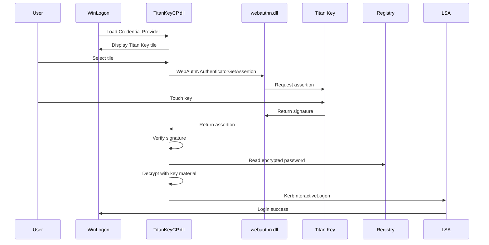

# Titan Key Windows Credential Provider

## Architecture Overview




## Project Structure

```
KeyCred/
├── src/
│   ├── TitanKeyCredentialProvider.cpp   # Main CP implementation
│   ├── TitanKeyCredentialProvider.h
│   ├── TitanKeyCredential.cpp           # Individual credential tile
│   ├── TitanKeyCredential.h
│   ├── WebAuthnHelper.cpp               # WebAuthn/CTAP wrapper
│   ├── WebAuthnHelper.h
│   ├── CredentialStorage.cpp            # Registry encryption/decryption
│   ├── CredentialStorage.h
│   ├── guid.h                           # COM GUIDs
│   ├── dll.cpp                          # DLL entry points
│   └── resource.h
├── include/
│   └── common.h                         # Shared definitions
├── res/
│   └── TitanKeyCP.rc                    # Resources (icon, version)
├── tools/
│   ├── RegisterCredential.ps1           # Registration script
│   ├── UnregisterCredential.ps1         # Unregistration script
│   └── SetupCredential.ps1              # Store encrypted password
├── TitanKeyCP.def                        # DLL exports
├── CMakeLists.txt                        # Build configuration
└── README.md
```

## Component Details

### 1. COM DLL Structure (ICredentialProviderCredential2)

Implement these COM interfaces:

- `ICredentialProvider` - Main provider interface, creates credentials
- `ICredentialProviderSetUserArray` - Receives user list from LogonUI
- `ICredentialProviderCredential2` - Individual credential tile with user context
- `IConnectableCredentialProviderCredential` - For async authentication flow

Key registry configuration:

```
HKLM\SOFTWARE\Microsoft\Windows\CurrentVersion\Authentication\Credential Providers\{GUID}
  (Default) = "Titan Key Credential Provider"
  
HKLM\SOFTWARE\Microsoft\Windows\CurrentVersion\Authentication\Credential Provider Filters\{GUID}
  (empty - only if filtering other providers)
```

### 2. WebAuthn Integration

Use Windows 10+ native `webauthn.dll` APIs:

```cpp
// Key functions from webauthn.h
HRESULT WebAuthNAuthenticatorGetAssertion(
    HWND hWnd,
    PCWSTR pwszRpId,
    PCWEBAUTHN_CLIENT_DATA pWebAuthNClientData,
    PCWEBAUTHN_AUTHENTICATOR_GET_ASSERTION_OPTIONS pGetAssertionOptions,
    PWEBAUTHN_ASSERTION *ppWebAuthNAssertion
);

HRESULT WebAuthNFreeAssertion(PWEBAUTHN_ASSERTION pWebAuthNAssertion);
```

The Titan Key will:

1. Receive a challenge (random bytes)
2. Sign it with the private key stored on the device
3. Return the assertion with signature

### 3. Credential Storage (Registry with DPAPI)

Store encrypted credentials at:

```
HKLM\SOFTWARE\TitanKeyCP\Credentials\{UserSID}
  EncryptedPassword = REG_BINARY (DPAPI encrypted)
  CredentialId = REG_BINARY (WebAuthn credential ID)
  PublicKey = REG_BINARY (for signature verification)
  RpId = REG_SZ (Relying Party ID, e.g., "windows.local")
```

Encryption: Use DPAPI with `CryptProtectData` (machine-level protection)

### 4. LSA Credential Serialization

For Kerberos interactive logon:

```cpp
KERB_INTERACTIVE_UNLOCK_LOGON kiul;
kiul.Logon.MessageType = KerbInteractiveLogon;
// Fill domain, username, password
// Serialize to authentication buffer for LogonUI
```

### 5. Authentication Flow

1. **Provider Load**: LogonUI loads DLL, calls `SetUserArray` with enumerated users
2. **Tile Display**: Show "Titan Key Login" tile for each registered user
3. **User Selection**: User clicks tile, triggers `Connect()` async operation
4. **WebAuthn Challenge**: Generate 32-byte random challenge
5. **Key Interaction**: Call `WebAuthNAuthenticatorGetAssertion`, user touches key
6. **Signature Verification**: Verify ECDSA signature using stored public key
7. **Credential Retrieval**: On success, read and decrypt password from registry
8. **LSA Logon**: Serialize credentials and return to LogonUI

### 6. Security Considerations

- Use DPAPI for credential encryption (ties to machine)
- Store only the public key, private key stays on Titan Key
- Challenge must be random and single-use
- Consider adding PIN support for additional factor
- Log authentication attempts for audit

### 7. Build Requirements

- Windows SDK 10.0.17763.0+ (for WebAuthn headers)
- Visual Studio 2019+ or CMake with MSVC
- Link against: `webauthn.lib`, `crypt32.lib`, `advapi32.lib`, `secur32.lib`

### 8. Testing Strategy

For testing with hardcoded password "1234":

1. Run `SetupCredential.ps1` to register and store encrypted "1234"
2. Register DLL with `RegisterCredential.ps1`
3. Lock workstation or sign out
4. Select Titan Key tile, touch key
5. Should log in with decrypted "1234" password

### 9. Registration Helper Tools

PowerShell scripts to:

- Register/unregister the COM DLL
- Store initial encrypted credentials per user
- Register WebAuthn credential with Titan Key (enrollment)

